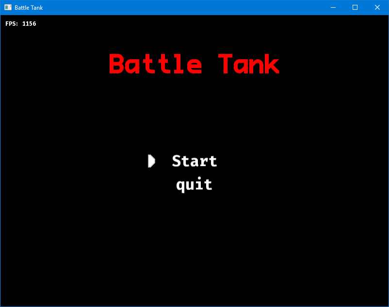

# Cpp Game Engine

This is just a test of cpp language features while using the time to play with game related
logic and patterns. Currently is using SFML but the idea was to separate the backend to
use different libraries even raw open gl.

If sometime i continue with this work I'll separate SFML from it, but from now I prefer to
have SFML in the guts of the code until all the other stuff is in place and the structure
of the engine emerges.

The solution is expecting SFML 2.5.0 in c:\SFML-2.5.0 folder. It's configure to link to sfml
using dynamic linking. In order for the compilation process to work, create a sfml folder
in the root, and inside two folders Debug and Release. In each one copy and paste the proper
dlls (SFML provides both debug and release versions). The project will take the correct ones
and copy them to the output folder.

There are a couple of resources included here just for the sake of testing. Thanks to Pro Font,
and Fira code for them.